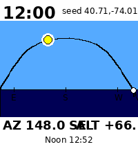
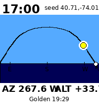
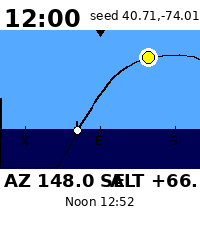
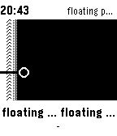
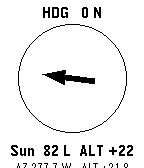
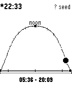
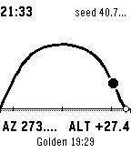
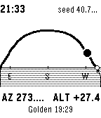
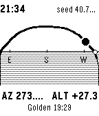

# Pebblehenge

A Sun Surveyor-style watchapp for the 2025/2026 Pebble lineup. Renders the
day's sun-path arc, the current sun position, sunrise / sunset and golden /
blue hour times, and rotates the projection with the watch's compass heading
so the user can physically aim the watch at where the sun is or will be.

Targets:

- **Pebble Time 2** (Core Devices "Core Time 2") — 200×228 64-color e-paper,
  touchscreen, heart-rate, compass, accelerometer, gyroscope, mic, speaker.
- **Pebble 2 Duo** (Core Devices "Core 2 Duo") — 1.26" 144×168 monochrome
  e-paper, 6-axis IMU, compass, barometer, no HR.

Both ship with the nRF52840 SoC and BLE 5. Neither has GPS — location comes
from the paired phone over PebbleKit JS.

## Screenshots

### Pebble Time 2 (emery, 200×228 color)

Rendered by `test/preview_emery.py`, which replays the exact `ui_arc.c`
projection at emery's resolution with Pebble's color palette. The
coredevices QEMU fork doesn't yet boot the F7xx "Robert" machine
(`Robert (F7xx) platform not yet ported to QEMU 10.x`), so the live
emulator path isn't available here; the build artifact is correct and
will run on real hardware unchanged.





### Pebble 2 Duo (diorite, 144×168 monochrome)

Captured live from the QEMU emulator (`pebble screenshot`):





### Phase 7 — accelerometer tilt compensation

Same arc, three gravity vectors sent via `pebble emu-accel`. The horizon
line slides up the canvas as the watch tilts upward (looking more at the
sky), so the user can naturally point the watch toward the horizon to
read sunrise / sunset markers or up at the sky to read midday sun
position. The arc geometry itself is unchanged — only the projection's
horizon-Y is reparameterised by pitch.





## How it works

### Sun position

`src/c/sun.c` is a port of the public-domain NOAA Solar Calculator
([gml.noaa.gov/grad/solcalc](https://gml.noaa.gov/grad/solcalc/)). One
module gives position **and** every derived event from the same Julian-day
computation:

- Solar declination, equation of time, hour angle
- Sun azimuth / altitude (refraction-corrected via Bennett's polynomial)
- Sunrise / sunset / solar noon (hour-angle inversion at zenith 90.833°)
- Civil / nautical / astronomical twilight (zeniths 96° / 102° / 108°)
- Golden-hour boundary (altitude +6°), blue-hour boundary (altitude −4°)

Accuracy: ≤0.05° in position and ≤15 s in event times for 1950–2050,
verified against SunCalc.org and NOAA reference values in
`test/sun_test.c` (13 tests, all passing).

### Trig without libm

Pebble's app loader applies relocations for the app's own `.text` / `.data`
but **not** for newlib libm's internal lookup tables (`npio2_hw`,
`two_over_pi`, `__ieee754_sqrtf`'s bias table). Any call to `sin/cos/tan/
asin/acos/atan2/sqrt` — single or double precision — hard-faults on the
first lookup. The SDK also targets Cortex-M3, so even `sqrtf` goes through
the soft-float code path.

`src/c/sun.c` therefore ships self-contained replacements:

- 7th-order Horner sine in [−π/2, π/2] with quadrant folding
- `cos = sin(x + π/2)`, `tan = sin / cos` with epsilon guard
- 9th-order minimax atan with Cotes range reduction
- `asin = atan(x / sqrt(1 - x²))`, `acos = π/2 − asin`
- 5-iteration Newton-Raphson sqrt
- Truncating `fmod`

All measured error budgets fit inside the 0.05° / 15 s budget the host
tests check against.

### Sky-dome projection

`src/c/ui_arc.c` projects the day's 49 half-hour samples onto a
heading-aware 2D view. The horizontal axis is the **azimuth offset from
the observer's current heading**; the vertical axis is **altitude**. The
result is a rainbow-shaped arc whose endpoints sit on the horizon at
sunrise (lower-left) and sunset (lower-right); a filled disc marks the
sun's current position.

When the compass is calibrated, the projection rotates with heading — turn
the watch and the sun slides into / out of screen-centre. When the compass
is uncalibrated (status anything other than `CompassStatusCalibrated`,
which includes the QEMU emulator's `-1` sentinel), the view auto-centres
on the solar-noon azimuth so the arc is always symmetrically visible.

Field of view is 240° horizontal × 110° vertical (90° above horizon and
−20° below).

### Two-target build

Single source tree compiles for both targets via `package.json`'s
`targetPlatforms: ["diorite", "emery"]`. Renderer split via `#if defined`:

- `PBL_COLOR` — full palette (`GColorPictonBlue` sky, `GColorOxfordBlue`
  ground, `GColorYellow` sun, `GColorBlack` arc)
- `PBL_BW` — 8×8 hatch patterns for the ground band, 1-px arc segments
  with dotted below-horizon style, white halo behind sun ball

`sun.c`, `geo.c`, `compass.c`, `ui_arc.c`'s projection code, and
`main.c` are all platform-agnostic.

## Project layout

```
pebblehenge/
├── package.json                  # SDK 4 manifest, targets emery + diorite
├── wscript                       # waf build script
├── src/
│   ├── c/
│   │   ├── sun.{c,h}             # NOAA port, self-contained trig
│   │   ├── geo.{c,h}             # fix + declination + persistence
│   │   ├── compass.{c,h}         # CompassService wrapper + declination
│   │   ├── ui_arc.{c,h}          # sky-dome renderer (color + mono paths)
│   │   └── main.c                # window, AppMessage, click handlers
│   └── pkjs/
│       └── index.js              # phone GPS, declination, AppMessage TX
├── screenshots/                  # diorite live captures + emery previews
├── test/
│   ├── sun_test.c                # 13 host-side gcc tests for sun.c
│   ├── Makefile                  # `make test`
│   └── preview_emery.py          # PIL-based emery color preview
└── README.md
```

## Phase progression

1. **Phase 1** — NOAA port + host test suite. `src/c/sun.{c,h}`,
   `test/sun_test.c`. Solar-noon altitude within 0.05° of reference,
   event times within 15 s.
2. **Phase 2** — text-only watchapp. `TextLayer`s for AZ / ALT / rise /
   noon / set, MINUTE_UNIT tick.
3. **Phase 3** — phone GPS + persistence. `pkjs/index.js` fetches phone
   geolocation, TZ offset, NOAA magnetic declination (cached 30 days);
   `geo.c` persists via `persist_write_*` under a versioned schema.
4. **Phase 4** — compass overlay. `compass.c` wraps `CompassService` with
   declination applied; Select button toggles a bearing-to-sun arrow
   view with calibration banner.
5. **Phase 5** — graphical sun-path arc with twilight bands (initial
   time-axis version).
6. **Phase 6** — Up/Down timeline scrub (auto-releases after 6 s of no
   input), app glance for next event.
7. **(rebuild)** — replaced the time-axis chart with the proper sky-dome
   projection (current state).
8. **Phase 7** — tilt compensation. `src/c/imu.{c,h}` subscribes to
   `AccelerometerService` at 10 Hz, smooths gravity with an EMA
   (α = 0.15, ~0.3 s settle), derives pitch as
   `atan2(-y, sqrt(x² + z²))`, and forwards a `pbh_attitude_t` to
   `ui_arc.c`. The renderer slides the horizon line from the bottom of
   the canvas (face up, looking at the sky) to the top (face down,
   looking at the ground) as pitch sweeps 0..180°. A 1.5° dead zone in
   `ui_arc_set_pitch` keeps the canvas from redrawing on every accel
   sample when the watch is held steady. Atan/sqrt are duplicated
   inline (sun.c's private helpers aren't exported) so the IMU module
   stays libm-free for the same Pebble app-loader relocation reason
   sun.c does.

## Build

### Local toolchain set-up (Ubuntu)

```sh
# Pebble CLI (Python 3)
python3 -m venv ~/pebble-venv
~/pebble-venv/bin/pip install pebble-tool

# SDK core (not yet served by sdk.repebble.com programmatically)
git clone https://github.com/coredevices/sdk-core ~/pebble-tmp
mkdir -p ~/.pebble-sdk/SDKs/4.4
mv ~/pebble-tmp/sdk-core ~/.pebble-sdk/SDKs/4.4/sdk-core
ln -s 4.4 ~/.pebble-sdk/SDKs/current
cp ~/.pebble-sdk/SDKs/4.4/sdk-core/package.json ~/.pebble-sdk/SDKs/4.4/package.json
(cd ~/.pebble-sdk/SDKs/4.4 && npm install --no-audit --no-fund)
python3 -m venv ~/.pebble-sdk/SDKs/4.4/.venv
~/.pebble-sdk/SDKs/4.4/.venv/bin/pip install -r ~/.pebble-sdk/SDKs/4.4/sdk-core/requirements.txt

# arm-none-eabi toolchain
sudo apt-get install -y gcc-arm-none-eabi libnewlib-arm-none-eabi \
                        libstdc++-arm-none-eabi-newlib
mkdir -p ~/.pebble-sdk/SDKs/4.4/toolchain/arm-none-eabi/bin
for f in /usr/bin/arm-none-eabi-*; do
  ln -sf "$f" ~/.pebble-sdk/SDKs/4.4/toolchain/arm-none-eabi/bin/"$(basename "$f")"
done

# Pebble QEMU (for the emulator)
sudo apt-get install -y ninja-build meson pkg-config libsdl2-dev libpng-dev \
                        libpixman-1-dev libglib2.0-dev xvfb
git clone --depth=1 --branch=pebble-10.1 https://github.com/coredevices/qemu /tmp/qemu-src
(cd /tmp/qemu-src
 ./configure --target-list=arm-softmmu --disable-werror --disable-docs \
             --enable-sdl --enable-png --disable-tools --without-default-features
 ninja -C build qemu-system-arm
 sudo install build/qemu-system-arm /usr/local/bin/qemu-pebble)
```

### SDK patches required for modern arm-none-eabi-gcc

The SDK was built against gcc ~4.7. With gcc 13:

1. `~/.pebble-sdk/SDKs/4.4/sdk-core/pebble/<plat>/include/pebble.h` —
   add `#include <sys/types.h>` before `#include <time.h>` so `time_t`
   is in scope when the SDK's `-D_TIME_H_` suppresses newlib's full
   `<time.h>`.
2. `pebble_sdk_gcc.py` — add `-Wno-builtin-macro-redefined`,
   `-Wno-error=implicit-function-declaration`, and
   `-Wno-error=builtin-declaration-mismatch` to `c_warnings` so the
   SDK's `__FILE_NAME__` redefinition and pebble.h's `int strftime`
   declaration don't trip `-Werror`.

### pypkjs patch for IPv6-disabled hosts

`pypkjs/runner/websocket.py:80` — change
`pywsgi.WSGIServer(("", self.port), ...)` to
`pywsgi.WSGIServer(("127.0.0.1", self.port), ...)`. The default empty
host string makes gevent prefer IPv6, which fails with `Address family
not supported by protocol` on environments without IPv6.

### Build the app

```sh
source ~/pebble-venv/bin/activate
pebble build       # produces build/pebblehenge.pbw
make -C test test  # host-side sun algorithm tests (13/13)
```

### Run

```sh
# Headless: virtual X display for SDL
Xvfb :99 -screen 0 800x600x24 -ac &
DISPLAY=:99 pebble install --emulator diorite

# Pebble install puts the app on the launcher; force-launch via libpebble2
python3 -c '
import uuid, subprocess, time
from libpebble2.communication.transports.websocket import WebsocketTransport
from libpebble2.communication import PebbleConnection
from libpebble2.protocol.apps import AppRunState, AppRunStateStart
out = subprocess.check_output(["lsof","-i","-nP","-sTCP:LISTEN","-c","python3"], text=True)
port = next(int(l.rsplit(":",1)[1].split()[0]) for l in out.splitlines()
            if "127.0.0.1:" in l and "python" in l.lower())
c = PebbleConnection(WebsocketTransport(f"ws://localhost:{port}/"))
c.connect(); c.run_async(); time.sleep(1)
c.send_packet(AppRunState(data=AppRunStateStart(uuid=uuid.UUID("0d8b3f6a-5e2c-4f4e-9c1d-2f7a1c4a9b00"))))
time.sleep(3)
'

pebble emu-set-time 1779120000   # 2026-05-18 16:00 UTC (NYC solar noon)
pebble screenshot screenshot.png

# For an emery-resolution color preview while the F7xx port is unfinished:
python3 test/preview_emery.py    # writes screenshots/emery-*.png
```

## Known limitations

- **Emery emulator** — `coredevices/qemu pebble-10.1` doesn't boot the
  Robert F7xx machine; `test/preview_emery.py` is the workaround for
  visual review until the port lands upstream.
- **Compass calibration in emulator** — QEMU reports
  `CompassStatus = -1` (sentinel for "unavailable") rather than the
  documented enum values, so `emu-compass --calibrated` doesn't actually
  enter the calibrated branch. On real hardware after a figure-8 wave the
  status reaches `Calibrated` and heading rotation kicks in.
- **Launcher behavior** — `pebble install` lands on the launcher with
  the app highlighted; it does **not** auto-launch. Send an
  `AppRunStateStart` via libpebble2 to trigger the actual app entry
  point (see the run snippet above).

## License

Application code: MIT.
NOAA Solar Calculator port: public domain (US Government work, per NOAA
ESRL terms).
